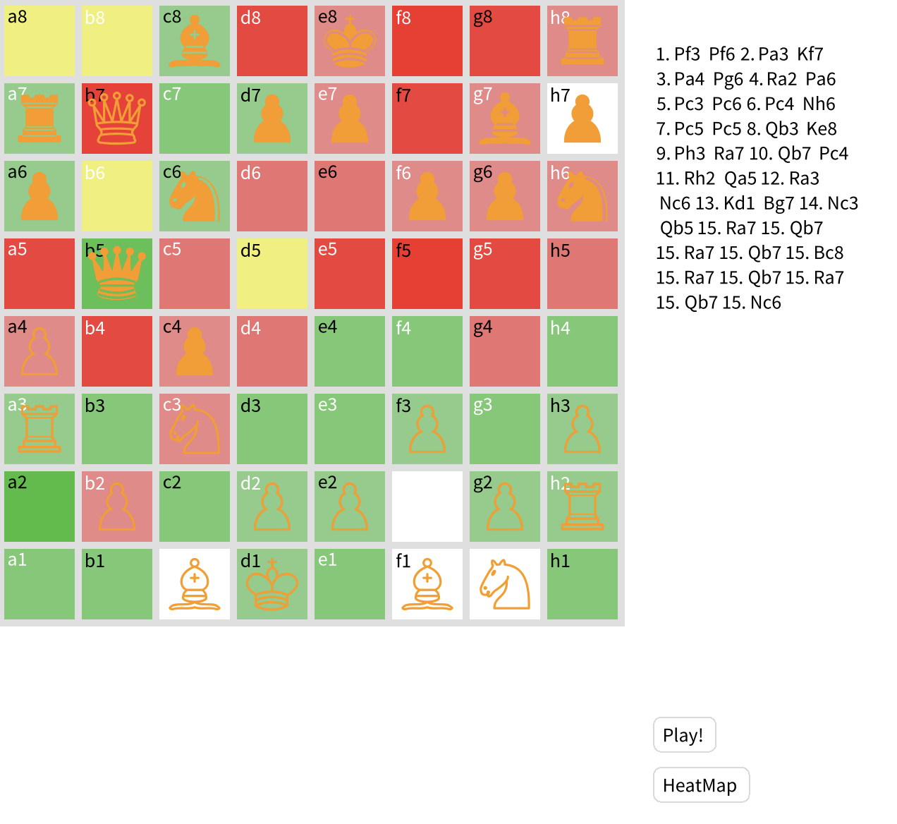

# Report Task 1: manual testing and refactoring

Student: Mayara SIMOES DE OLIVEIRA CASTRO
--

The chosen kata was the `Positional Heatmap`, the goal is to show, through colors, the influence of each team's pieces in the board. 

To run the game:
```
board := MyChessGame freshGame.
board size: 800@600.
space := BlSpace new.
space root addChild: board.
space pulse.
space resizable: true.
space show.
```



## Functionalities to test
For the refactoring of the Positional Heatmap feature, the primary functionalities to test focus on:
- heatmap activation
- heapmap deactivation
- calculation of piece influence
- color rendering of the squares based on piece influence
- ensuring that the board can correctly reset the square colors when the heatmap is disabled.

Below are the functionalities and corresponding manual tests.

## Tests created by functionality
### Heatmap activation and deactivation
#### Test Explanation: testHeatMapActivationDefaultInitialValue


This test verifies that the default state of the heatmap is correctly initialized to off when starting a fresh game. Since the heatmap is an optional feature, it is important that it starts in a deactivated state unless explicitly turned on. This test ensures that the system doesn’t unexpectedly activate the heatmap, which could otherwise result in unnecessary calculations or performance issues right at the beginning of the game.

#### Test that were not implemented:
- testActivateHeatMap
- testDeactivateHeatMap 
These two tests need to test if the methods to paint the heatmap and to reinitialize the board were called, respectively. This would need to create a mock and spy the methods, I haven't found a way to do this easily in pharo. 


### Piece influence
#### Test Explanation: testCalculateInfluenceForWhitePiece


This test ensures that the correct influence is applied for white pieces and that the engagement values reflect the control of the squares based on the movement rules of the white pawn.

#### Test Explanation: testCalculateInfluenceForBlackPiece
 
This test ensures the correct calculation of influence from a black piece, specifically how engagement values are applied to its attack squares. It validates that the calculation respects the rules of black piece movement and influence on the board.

#### Test Explanation: testCalculateNeutralInfluenceForSquare

This test checks the accurate calculation of influence on neutral squares and verifies that engagement is not applied where it shouldn’t be, ensuring that only squares influenced by pieces are affected. This is important for generating accurate heatmaps and ensuring the calculation logic respects chess movement rules.

#### Test Explanation: testCalculateInfluenceForPiecesWithNoLegalMoves
 
This test verifies that when a piece is in a position where it cannot make any legal moves (as with the black pawn on e1), the system correctly ignores it in the influence calculation. It ensures that the calculation does not mistakenly apply engagement to squares when there should be none.

### Color rendering
####  Test: testInfluenceColors
```
testInfluenceColors

	| squares board squareColor |
	board := MyChessBoard empty.
	"Place black pieces on the board"
	board at: 'a7' put: MyRook black.
	board at: 'd8' put: MyQueen black.
	board at: 'b6' put: MyKnight black.
	
	"Place white pieces on the board"
	board at: 'a2' put: MyPawn white.
	board at: 'e2' put: MyBishop white.
	board at: 'g1' put: MyKnight white.
	board at: 'd1' put: MyQueen white.
	
	board paintHeatMap.

	squares := board squares.
	squares do: [ :square |  
		squareColor := square background paint color.
		square ifNotNil: [ 
			
			square engagement 
			ifNil:  [
					"Engagement non existent"
					self assert: square engagement isNil.
    		]
    		ifNotNil: [
        		square engagement < 0
            ifTrue: [
                "Engagement is negative"
					self assert: squareColor red > 0.
                self assert: squareColor green equals: 0.
            ]
            ifFalse: [
					square engagement > 0
            		ifTrue: [
                	"Engagement is positive"
        				self assert: squareColor red equals: 0.
            		]
            		ifFalse: [
                	"Engagement is zero"
                	self assert: squareColor red > 0.
					].
				   self assert: squareColor green > 0.
            ].
				self assert: squareColor blue equals: 0.
    		].
		].
	].
```
This test checks that the heatmap coloring system correctly reflects the influence values of pieces in the board. The heatmap colors squares based on the control (engagement) by black and white pieces, and it is critical to verify that the coloring logic is correct.


#### Test: testInfluenceColorIntensityWhite and testInfluenceColorIntensityBlack
```
testInfluenceColorIntensityWhite
	
	| squares board previousSquareColor currentSquareColor sortedSquaresByEngagement currentSquareEngagement previousSquareEngagement |
	board := MyChessBoard empty.
      
    board at: 'c3' put: MyKnight white.       
    board at: 'e3' put: MyQueen white.        
    board at: 'f3' put: MyBishop white.
	
	
	board paintHeatMap.
	
	sortedSquaresByEngagement := board squares sort: [ :square1 :square2 | 
		(square1 isNotNil and: square2 isNotNil) ifTrue: [
			(square1 engagement isNotNil and: square2 engagement isNotNil) ifTrue: [ 
				square1 engagement abs > square2 engagement abs
			 ] ifFalse: [
				false.]. 
			 ].
		 ].
	
	sortedSquaresByEngagement do: [ :square | 
		square ifNotNil: [ 
			currentSquareColor := square background paint color.
			square engagement ifNotNil: [
				previousSquareColor ifNotNil: [ 
				 
					currentSquareEngagement := square engagement abs.
					previousSquareEngagement ifNotNil: [ 
						
						Transcript show: 'Engagement: ', (currentSquareEngagement) asString; cr.
						previousSquareEngagement > currentSquareEngagement
						ifTrue: [ 
							self assert: previousSquareColor alpha > currentSquareColor alpha.
							 ]
						ifFalse: [
							"then same engagement"
							self assert: previousSquareColor alpha <= currentSquareColor alpha.
							].
					].
					 ].
				previousSquareColor := square background paint color.
				
				 ].
			previousSquareEngagement := currentSquareEngagement.
			
			
		].
	].
```
Another version of this test is created to test the intensity of influence for black pieces.
The `testInfluenceColorIntensityBlack` and `testInfluenceColorIntensityWhite` test is designed to ensure that squares controlled by black pieces exhibit the correct color intensity based on the engagement levels calculated from their positions. In this context, higher engagement (more influence) should correspond to stronger colors (higher alpha) on the heatmap, indicating a player's control over the squares.


### Board color reset
#### Test: testReinitializeBoardColorsContentsPreservation
```
testReinitializeBoardColorsContentsPreservation
    | board originalColors |
    
    board := MyChessBoard empty.
    "Set up some initial contents for squares"
    board at: 'a7' put: MyPawn white.
    board at: 'a2' put: MyKnight black.
    board at: 'a3' put: MyBishop white.
    
    originalColors := board squares collect: [ :square | square background paint color. ].
	
	 board paintHeatMap .
    board reinitializeBoardColors.

    "Ensure the contents of squares are unchanged"
    board squares with: originalColors do: [ :square :originalColor |
        self assert: square background paint color equals: originalColor.
    ].
```
The purpose of the testReinitializeBoardColorsContentsPreservation test is to verify that the reinitializeBoardColors method correctly resets the color of the squares on the chessboard.


### What was Not Tested:
- Speed and performance:
    - Speed and performance of rendering the heatmap are not directly tested here. The primary goal of the existing tests is to ensure that the heatmap accurately reflects the engagement levels of pieces on the chessboard. Speed and performance are secondary concerns when validating the correctness of functionality.
- Visual verification of Correct Colors: 
    - It was tested that the background color attribute of the squares are changed, but it is not automatically tested if in fact visually it is changed. This would probably require another tool/technique for testing and have a higher complexity.

# Implementation of the kata
To implement this kata, the main goal was to add a feature that calculates the influence each player exerts on every square of the chessboard. This influence is visually represented using a heatmap to help players understand the control dynamics of the board in real time.

Influence Calculation:

The influence is calculated by evaluating the legal moves of each piece on the board. Each piece has pre-existing methods that provide the list of legal target squares it can move to. For every square on the board, an engagement value is now computed:

-	Positive engagement: Indicates white’s influence on the square.
-	Negative engagement: Indicates black’s influence on the square.
-	Zero engagement: Means the square is neutral or equally controlled by both players.

The engagement value reflects how much control each player has over a square. 

**Heatmap Visualization:**

Based on the calculated engagement value, the background color of each square changes:
-	Red: Indicates stronger black control.
-	Green: Indicates stronger white control.
-	Yellow: Indicates neutral control.

The strength of the color depends on the absolute engagement value:

-	The higher the engagement value, the stronger the color. For example, a square heavily controlled by white would be a bright green.
-	The lower the engagement value (i.e., black has more control), the stronger the red shading.
-	If the engagement value is close to zero, the square turns yellow, indicating neutral influence.

Interactive Heatmap:

A button has been added to toggle the heatmap feature on or off. When the heatmap is enabled, the influence for each square is recalculated after every move. This ensures that the heatmap stays up-to-date, dynamically reflecting changes in board control as the game progresses.

This feature provides players with an additional tool to visually assess the influence each player has over the board, enhancing strategic planning during gameplay.

