# Report Task 2:  mutation testing

Student: Mayara SIMOES DE OLIVEIRA CASTRO
--
In this mutation testing exercise, we evaluated several classes in our chess project, focusing on the following key classes:

```
testCases :=  { MyRookTests. MyKingTest. MyFENTest. MyBishopTests }.
classesToMutate := { MyPiece. MyRook. MyKing. MyBishop. MyFENParser. }.

analysis := MTAnalysis new
    testClasses: testCases;
    classesToMutate: classesToMutate.

analysis run.
```

These classes were selected because they already had existing test cases associated with them. This pre-existing coverage is crucial for mutation testing, as it provides a baseline to evaluate the effectiveness of the tests in detecting faults introduced by the mutants. By targeting classes with existing tests, we could immediately assess how well our tests were performing against a range of potential faults.

## Initial Mutation Score

Upon executing the mutation tests, we obtained a mutation score of **41%**, indicating that only 41% of the mutants were killed by the existing test cases. 

## Surviving Mutants Analysis

To further analyze the surviving mutants, we grouped them by method and identified those methods with the most surviving mutants. 

```
((analysis generalResult aliveMutants)
	groupedBy: [ :m |m mutant originalMethod ])
		associations sorted: [ :a :b | a value size > b value size ].

```

The analysis yielded a list of methods, with a particular focus on:

	MyKing>>#targetSquaresLegal
    MyFENParser>>#parse
	MyKing>>#basicTargetSquares
	MyKing>>#isCheckMated

These methods had a significant number of surviving mutants, and indicated a lack of test coverage.

Multiple tests were created the kill the surviving mutants, some of them are explained in the next section.

## Detailed Analysis of Surviving Mutants
### MyKing>>#targetSquaresLegal
#### Mutation 1:
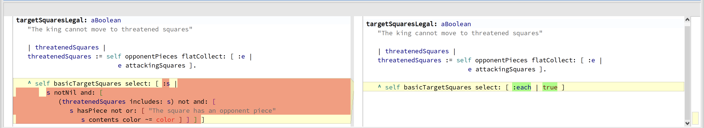
This mutant selects all squares that a piece could move if there were no obstacles. Which injects a bug for when it's not possible to move a piece to a square due to an obstacle.

In this case, to kill the mutant, we need to test if ONLY the  expected squares are being taken in consideration

Test : 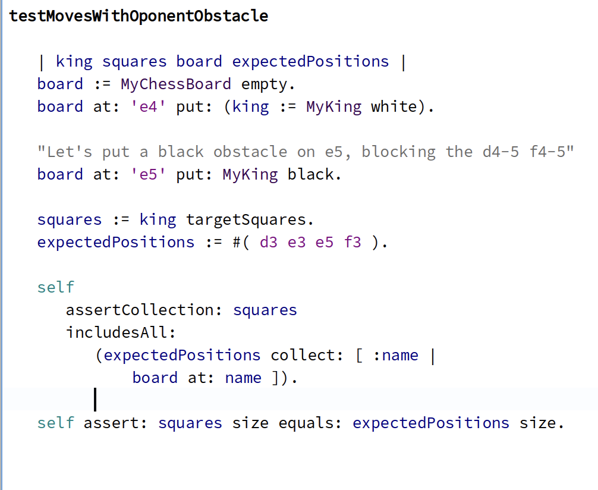
In this test it was added an obstacle in the possible path the piece could move, which reduces the possibilities of expected squares to move.

### MyKing>>#isCheckMated

The original method isCheckMated determines whether the king is in a checkmate position. It does so by checking two conditions:

-	if the king has any legal moves left.
-	whether the king’s current square is threatened by any opponent pieces.

If both conditions are true, it concludes that the king is in checkmate.


In the mutant, the second condition is altered. Instead of checking whether the king’s square is threatened by opponent pieces, the mutant simply returns true in the second part of the condition, which means that the check for whether the king is under attack is bypassed.

The mutant changes the behavior of the isCheckMated method significantly. By always returning true in the second condition, the method will incorrectly conclude that the king is in checkmate any time there are no legal target squares left, regardless of whether the king is actually under attack.

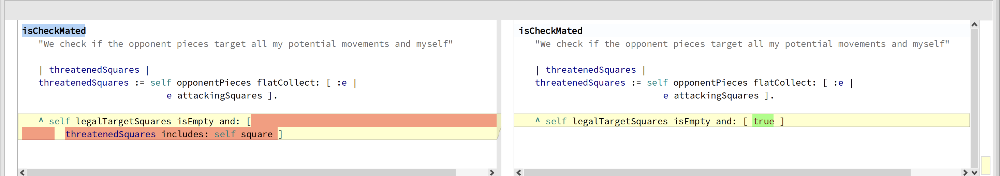


##### Killing the mutant
To kill this mutant, we need a test to verify that the king is only considered in checkmate if both conditions are true(the king has no legal moves and is under attack).

Test:
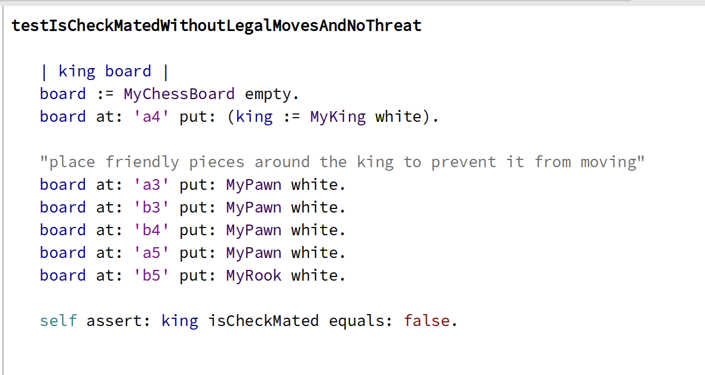

This test ensures that the king, while having no legal moves, is not checkmated because its square is not being attacked. If the mutant is still present, this test will kill the mutant.


#### Mutation 2:
In the mutant, the first condition is replaced with true. This change results in the method always assuming that the king has no legal moves, regardless of the actual state of the board.
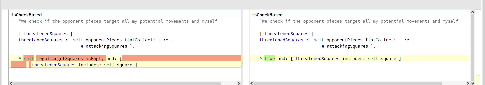
The method now ignores the check for legal moves, meaning it will always evaluate the second condition. As a result, the method may incorrectly conclude that the king is checkmated, even if it still has legal moves available.

##### Killing the mutant
To kill this mutant, we need a test to check a situation where the king has legal moves but is still threatened. This scenario would ensure that the isCheckMated method does not return true unless the king truly has no legal moves.

Test:
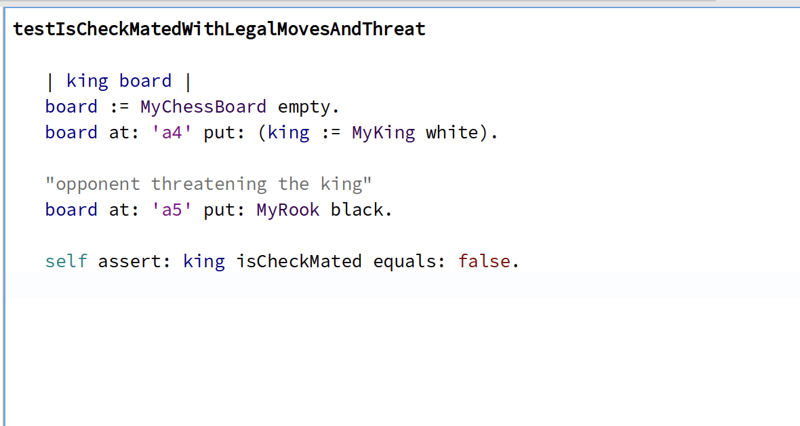
The test ensures that if the king is threatened but still has legal moves, the method isCheckMated should return false. If the mutant is present, the test will fail because the method will incorrectly return true, detecting checkmate when it shouldn’t.

### MyFENParser>>#initialize
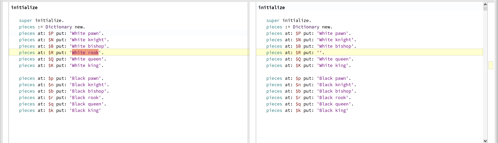 

The mutant in question likely involves changing the values in the piecesDictionary. For example, the mutant might swap "White pawn" for "Black pawn" or alter the dictionary’s structure, which could lead to incorrect mappings between FEN characters and chess pieces.

#### Killing the mutant
The test to kill this mutant asserts the correct mappings between the FEN character and the expected chess piece, this ensures that any mutation which alters these mappings will result in a test failure.

test:
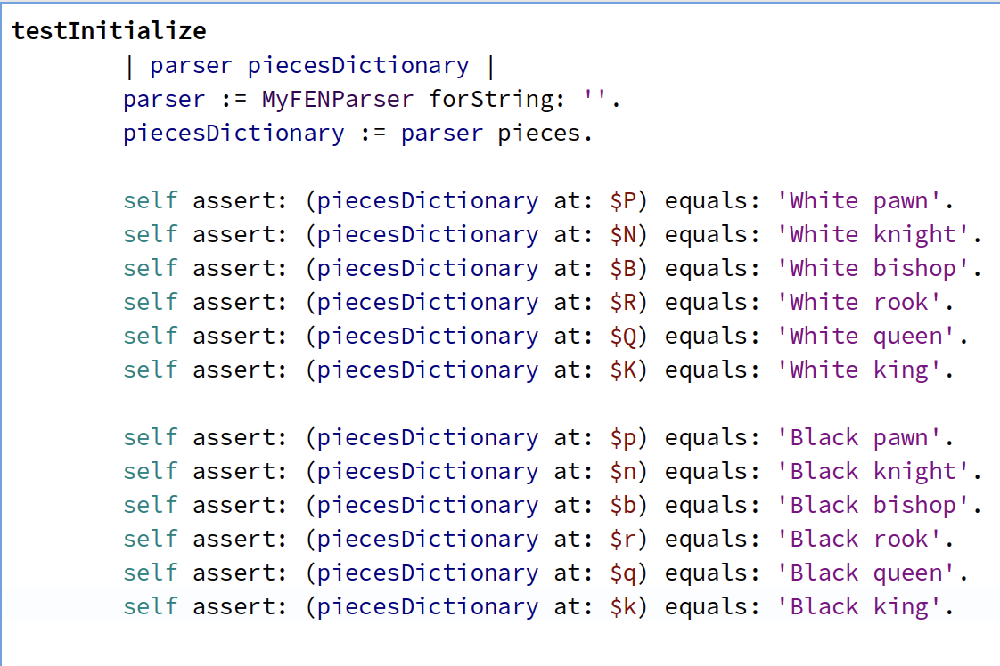


## Equivalent Mutants

### 1
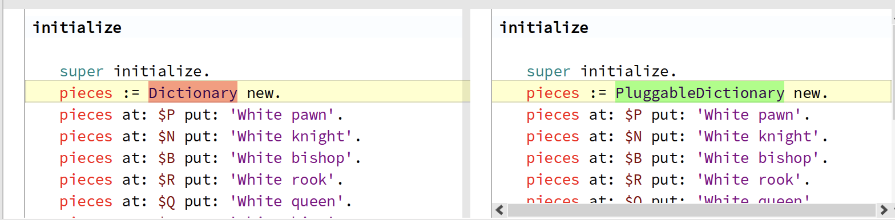
### 2
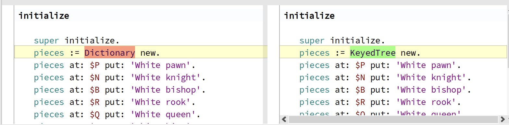
### 3
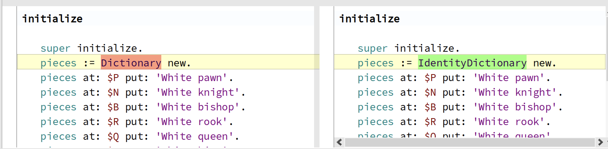

These 3 mutants cannot be killed by any tests because they are functionally equivalent to the original code. In this case, some mutants change the type of pieces Dictionary to subclasses of Dictionary (IdentityDictionary, WeakKeyDictionary, etc.), but since these subclasses behave similarly for the current use case, the functionality remains the same. Therefore, these mutants are considered equivalent mutants.


# Minimizing Equivalent mutants
It was implemented a mutant selection strategy to specifically avoid generating tests for the subclass replacement mutants in the #inialization method of MyFENParser, that are explained above to be equivalent mutants.


Script to add the selection strategy to the analysis:
```
analysis mutantGenerationStrategy mutantSelectionStrategy: ChessFilterMutantSelectionStrategy new.
```

Selection strategy code:
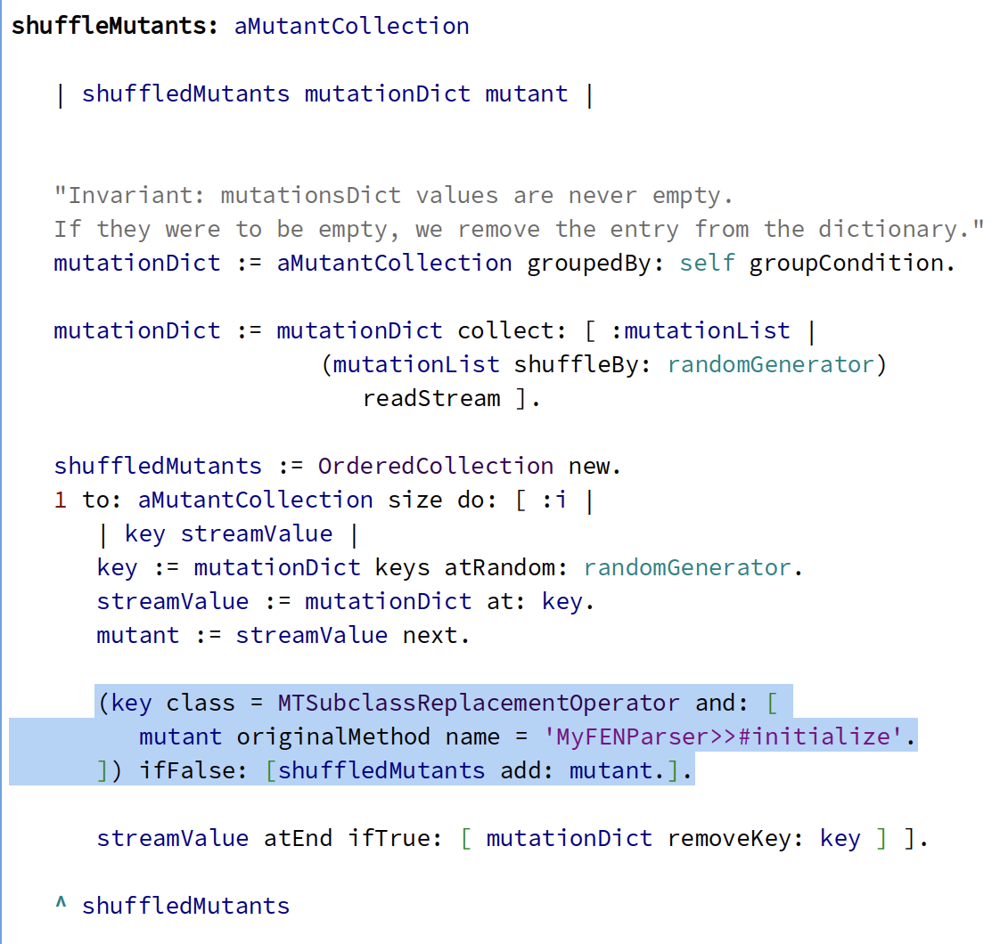

#### Explanation of the Implementation

- **Grouping Mutants**:
    - The method first groups mutants by mutation operation. This organizes the mutants, making it easier to apply specific filtering criteria later.
- **Identifying Equivalent Mutants**:
    - The filtering condition specifically checks:
        - If the mutation operator is MTSubclassReplacementOperator (this indicates that the mutant modifies class type).
        - If the mutant pertains to the method MyFENParser>>#initialize.

- **Filtering Logic**:
    - If both conditions are satisfied, that mutant is not added to the list of mutants, effectively filtering it out of the testing process.
    - If the conditions are not met, the mutant is added to the collection for further testing.

We can safely remove this mutant operator from the MyFENParser>>#initialize because the only class that is instantiated in this method is indeed the Dictionary class witch we identified the replacement of it by its subclasses would be an equivalent mutant, so we wouldn't be affecting other mutants by removing it.


## Result
After the improvements, the mutation score rose to **79%**. This means that the updated tests are now effectively detecting and handling a greater portion of the introduced faults.
